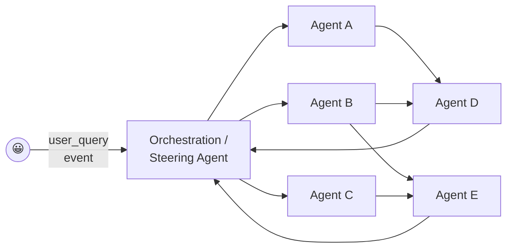

## Multi - Agents

```mermaid
graph LR
    user((😀))
    user -->|user_query<br>event| orchestrator[Orchestration /<br>Steering Agent]

    orchestrator --> A[Agent A]
    orchestrator --> B[Agent B]
    orchestrator --> C[Agent C]

    A --> D[Agent D]
    B --> D
    B --> E[Agent E]
    C --> E

    D --> orchestrator
    E --> orchestrator

```